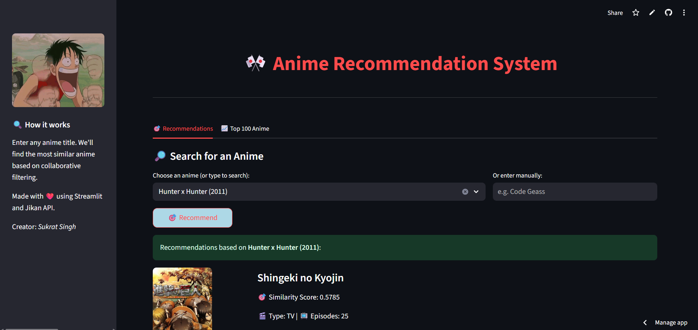
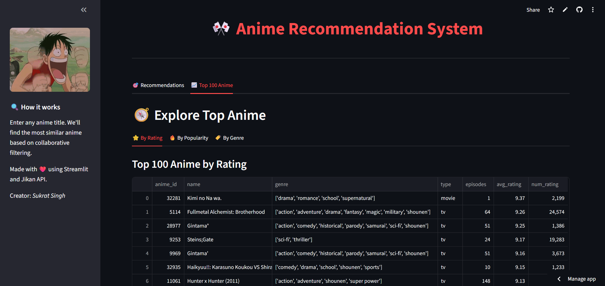
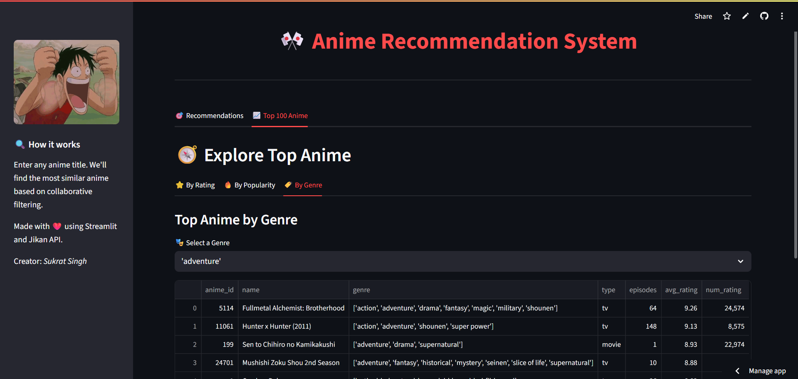

# 🎌 Anime Recommendation System

Welcome to the **Anime Recommendation System**, a Streamlit web app that recommends anime based on user input using collaborative filtering and cosine similarity. The app is enhanced with anime metadata, poster images from Jikan API, and interactive UI built using Streamlit components.

---

## 🚀 Live Demo

[🔗 Try the App on Streamlit Cloud](https://anime-recommender-cfy73atsxeadyjygatppdi.streamlit.app/)

---

## 📸 Preview

### 🔹 Home Page


### 🔹 Recommendations


### 🔹 Genre Explorer


---

## 🧠 How It Works

- 🔍 User searches for an anime title
- 🧮 Cosine similarity is computed from a precomputed user-rating pivot table
- 🎯 Top 15 most similar anime titles are recommended
- 🖼️ Anime posters and metadata are pulled in real-time using the [Jikan API](https://jikan.moe/)
- 📊 Top 100 anime visualized by rating, popularity, and genre

---

## 📁 Project Structure

anime-recommender/
├── app.py # 🎯 Main Streamlit app
├── anime.csv # 📄 Anime metadata
├── top_100_df.csv # 📄 Preprocessed top 100 anime
├── requirements.txt # 📦 Python dependencies
├── .gitignore # ❌ Ignored files (e.g. large model files)
└── README.md # 📘 Project documentation


---

## 📦 Getting Started

### 1. Clone the Repository
```bash
git clone https://github.com/Sukrat-Singh/anime-recommender.git
cd anime-recommender
```

### 2. Create and Activate a Virtual Environment (Optional)
```bash
python -m venv venv
# Activate it:
# On Windows:
venv\Scripts\activate
# On macOS/Linux:
source venv/bin/activate
```

### 3. Install Dependencies
```bash
pip install -r requirements.txt
```

### 4. Run the Streamlit App
```bash
streamlit run app.py
```
---

## 🔧 Built With
 - Streamlit

 - pandas

 - Jikan API

 - gdown

 - pickle

 - difflib

---

## 👤 Author

**Sukrat Singh**  
📂 [GitHub → @Sukrat-Singh](https://github.com/Sukrat-Singh)  
🔗 [LinkedIn](www.linkedin.com/in/sukratsingh)

---
